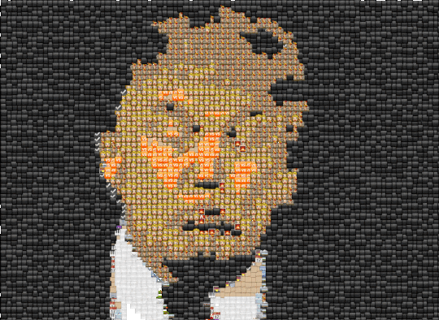
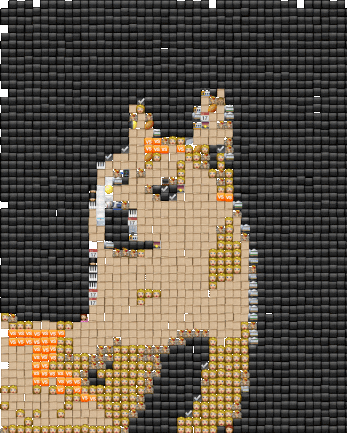
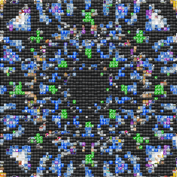

Turns images or gifs into emojis.

The way it works is to repeatedly sample random 32x32 segments of a target image, and for each segment it selects the best emoji to go in that location.

The "best" emoji is chosen based on Euclidean distance in pixel space. For example, in a given 32x32 segment of the target image, it treats the pixel values as a 32*32*3-dimensional vector, and picks the emoji (each of which is also a 32*32*3-d vector) such that the L2 norm between the two vectors is smallest.

## Examples

(If you squint, you can see more detail of the original image.)







<!--</img><br>
</img><br>
</img>-->

## Requirements

- Python (see `requirements.txt` for individual packages)
- [ImageMagick](https://www.imagemagick.org/script/index.php) to convert a collection of .png images to a single .gif

## Instructions

To process a single .png file, you can run something like:

```
python gifmoji.py output --targetfile input.png --force_add --target_upsample 4
```

Above, `--force_add` means that we must add an emoji at every segment of the target image, and `--target_upsample` means we will scale the target image's size by 4 to make an emoji image with better resolution.

To process a .gif into a series of .png made of emojis, you can run something like the following:
```
python gifmoji.py emoji-trump --targetfile trump.gif --is_gif --force_add --outdir images/trump --target_upsample 4
```

This will output a series of .png files named `emoji-trump-*.png`, where `*` will be 0, 1, 2, etc.

You can then run the following (using [ImageMagick](https://www.imagemagick.org/script/index.php)) to combine the .pngs into a single .gif:
```
convert -dispose previous -delay 1 emoji-trump-*.png emoji-trump.gif
```
